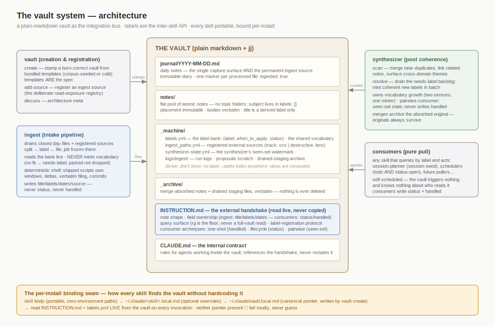
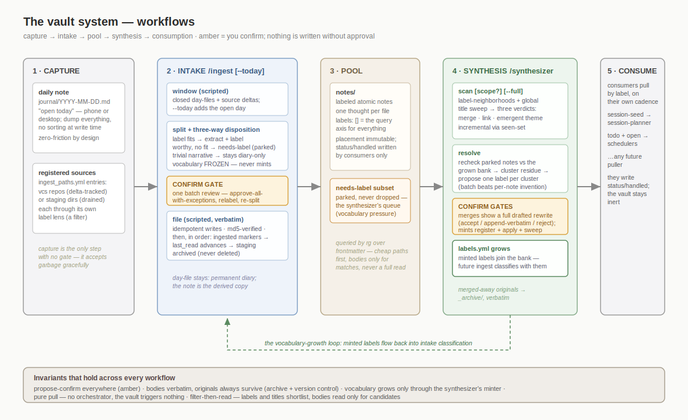

# The vault system

A portable personal knowledge system built on a plain-markdown vault — three linked materia
(**vault**, **ingest**, **synthesizer**) plus any consumer skill that queries it.

The vault itself is deliberately simple: a flat pool of atomic notes organized by a controlled
label vocabulary instead of folders, a `journal/` of daily notes that doubles as the capture
surface and the permanent ingest source, and a thin machine layer (`_machine/`) holding the label
bank and source registry. Everything an external skill needs to integrate lives in the vault's own
`INSTRUCTION.md` (read live, never copied) — which is why every skill here stays portable.

## The three materia

| Materia | Role | Subcommands |
|---------|------|-------------|
| **vault** (the anchor skill) | Creation & registration | `create` (stamp a born-correct vault from the `assets/` templates — corpus-seeded or cold), `add-source` (register an external ingest source), `discuss` (architecture meta) |
| **ingest** | Intake | `[source?] [--today]` (drain closed journal day-files + registered sources: split → label → file through one confirm gate), `status` (read-only health) |
| **synthesizer** | Pool coherence & vocabulary growth | `scan [scope?] [--full]` (propose merges, links, and labels for emergent themes), `resolve` (drain the `needs-label` backlog into coherent new labels) |

Consumers — session-planner today, any future puller — query notes by label on their own cadence
and write `status`/`handled`. The vault stays inert: it triggers nothing and knows nothing about
who reads it.

## Architecture

What exists, and who owns which field:

## Workflows

What happens, from capture to consumption. Amber marks the confirm gates — nothing is written
without approval:

## Lifecycle quickstart

1. **`/vault create [corpus-path?]`** — stamp a vault (from an exported-notes corpus, or cold).
   Writes the canonical pointer `~/.claude/vault.local.md`; every other skill finds the vault
   through it.
2. **Capture** — dump everything into today's daily note (`journal/YYYY-MM-DD.md`), phone or
   desktop. No sorting, no tags, no friction.
3. **`/ingest`** — when you feel like it, drain the closed days (and any registered sources) into
   labeled atomic notes. `--today` includes the open day so same-day actionables aren't blocked.
4. **`/synthesizer scan`** / **`/synthesizer resolve`** — periodically: merge near-duplicates,
   link related notes, and grow the label vocabulary from what ingest couldn't classify.
5. **Consume** — skills pull by label (`session-seed`, `todo AND status:open`, …) and act.

## Contracts (defined once, in the vault)

The authoritative integration contract is the stamped `INSTRUCTION.md` — see
[`skills/vault/assets/INSTRUCTION.md`](skills/vault/assets/INSTRUCTION.md), which is the template
every vault is born with.
Highlights:

- **Field ownership:** ingest writes `title`/`labels`/dates/`source`; consumers (and the human)
  write `status`/`handled`; `labels` after creation change only via the synthesizer's confirmed
  minting or the human.
- **Consumer archetypes:** one-shot (`handled` mark-all-seen), lifecycle (`status` filter),
  pairwise (seen-set watermark — the synthesizer).
- **Query surface:** ripgrep over frontmatter is the required floor; never a full-vault read.
- **Binding:** every skill resolves `~/.claude/<skill>.local.md` → `~/.claude/vault.local.md` →
  fails loudly. No skill hardcodes a vault path.

## Design history

The full design record (specs, decision diagrams, implementation plans) lives in the marketplace
repo at [`docs/superpowers/`](https://github.com/TuckerMoses/claude-materia/tree/main/docs/superpowers)
— see the `vault-skill`, `synthesizer-skill`, and `ingest-skill` documents. (Absolute URL so the
link survives a standalone plugin install.)
